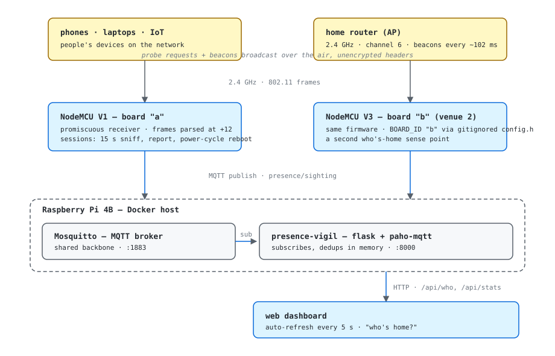

# presence-vigil

presence-vigil tracks devices around the house in real time using only
local hardware. A NodeMCU runs in promiscuous mode and grabs the raw WiFi
probe requests sent by nearby smartphones, then sends each logged event
over MQTT.

On the receiving end, a Python script on a Raspberry Pi reads the stream
and renders it to a web interface. This is not production-grade at all. I
spent a lot of time trying to get the radio interface working right for
reliable output — it felt like that part would never behave.

This serves as a functional application of embedded network analysis in a
hands-on way.

## How it fits together

```
[phone ~500m away]                       [Raspberry Pi 4B]
        | probe request                         |
        v                                        |
[NodeMCU A (V1)] --MQTT--> [Mosquitto] --> [aggregator] --> [web: who's home]
[NodeMCU B (V3)] --MQTT-->        ^                               |
                                  +---------------- localhost:8000 -+
```

- sniffers: `firmware/` — ESP8266 sketches (one per board, same core)
- hub: `pi/` — aggregator + dashboard (Docker on the Pi)
- docs: `docs/` — build log, deployment plan, block diagrams
- numbers: `measurements/`



*Block diagrams live in `docs/diagrams/` — one per subsystem (this one is
the whole chain, top to bottom).*

## Hardware

- 2× NodeMCU (ESP8266) — V1 (CP2102) and V3 (CH340)
- Raspberry Pi 4B, 8 GB — Mosquitto + aggregator + dashboard
- (board "a" now runs on its own power cable, board "b" on the Pi's USB;
  the battery-backed 12-node plan is in `docs/deployment.md`)

## Status

- [x] sniffing firmware (promiscuous receive, rxctl at +12)
- [x] board a flashed + sighting stream live
- [x] board b (V3) flashed + live — both streams on the dashboard
- [x] MQTT sightings -> broker
- [x] aggregator + who's-home dashboard
- [ ] measurements + photos (in progress)