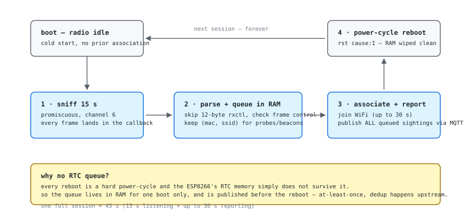
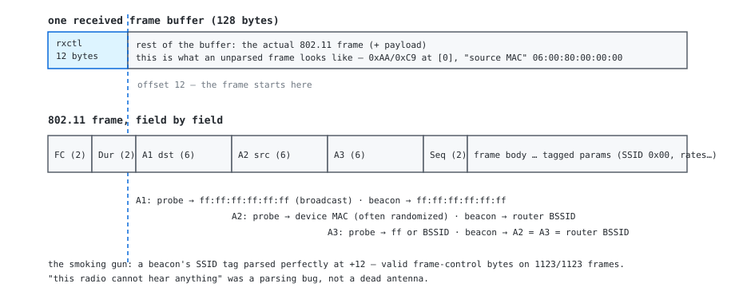

# firmware

One sketch, two boards. `presence-sniffer/` runs on both NodeMCUs
(V1 = CP2102, V3 = CH340), differing only by `BOARD_ID` in `config.h`.



*One session: sniff from a cold radio, parse, queue in RAM, report, then
power-cycle and do it again. ~45 s round trip.*

## build

```sh
arduino-cli compile --fqbn esp8266:esp8266:nodemcuv2 presence-sniffer
```

## flash (from source root)

```sh
arduino-cli upload -p /dev/cu.usbserial-XXXX --fqbn esp8266:esp8266:nodemcuv2 -i \
  $(arduino-cli compile --fqbn esp8266:esp8266:nodemcuv2 --output-dir build/tmp presence-sniffer \
    | grep -oE '/[^ ]+\.bin')
```
Or the short way (compile + upload in one step if you pass `--port`):
```sh
arduino-cli compile --fqbn esp8266:esp8266:nodemcuv2 -u -p /dev/cu.usbserial-XXXX presence-sniffer
```

## topics

| topic | direction | payload |
|---|---|---|
| `presence/sighting` | board -> hub | `{"board":"a","mac":"xx:xx:...","ssid":"..."}` |
| `presence/online` | board -> hub (LWT) | `{"board":"a"}` |

## notes

- Both boards share `nodemcuv2` as the board fqbn — the V1/V3 difference
  is only the USB-serial chip, not the MCU.
- Sniffing is locked to one channel (`SNIFF_CHANNEL`) — a phone probes the
  network's *own* channel most often, so matching the router's channel is
  what gets sightings. Channel-hopping would do better; not v1.



*The parsing lesson that cost a day: the SDK prepends a 12-byte rxctl
control header to every frame, so the 802.11 frame starts at offset 12
— not 0.*