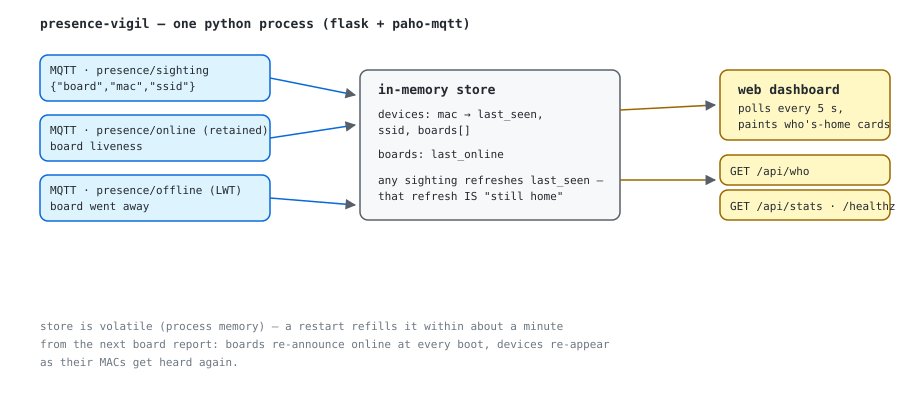

# pi — aggregator + dashboard

What runs on the Pi (the other half of the sensor). One process: an MQTT
subscriber that keeps an in-memory view of who was heard, plus a tiny
Flask HTTP server.

*MQTT in, REST out. The dedup rule is the whole trick: any report of a
MAC it already knows just refreshes last_seen — and that refresh *is* the
"still home" signal.*

- `app.py` — everything: MQTT attach on `presence/sighting` +
  `presence/online`, dedup window, REST API, dashboard page.
- `Dockerfile` / `requirements.txt` — container build.

Env: `MQTT_HOST` (default localhost), `MQTT_PORT` (1883), `HOME_S` (300 =
"who's home" window), `DEDUP_S` (120), `PORT` (8000).

Run on the Pi (mosquitto already lives in Docker on the same host):

    docker build -t presence-hub pi/
    docker run -d --name presence-hub --restart unless-stopped \
      -p 8000:8000 -e MQTT_HOST=172.17.0.2 presence-hub

`MQTT_HOST` is mosquitto's docker-bridge IP (check with `docker inspect
mosquitto | grep -i ipaddress`; it's `.2` when mosquitto is the first
bridge container). Talk to MQTT over docker-internal, and publish port
8000 the normal way — a host firewall on the Pi blocks bare host-network
binds from the LAN, which is why `--network host` quietly failed.

Dashboard: http://<pi>:8000  ·  API: /api/who, /api/stats, /healthz